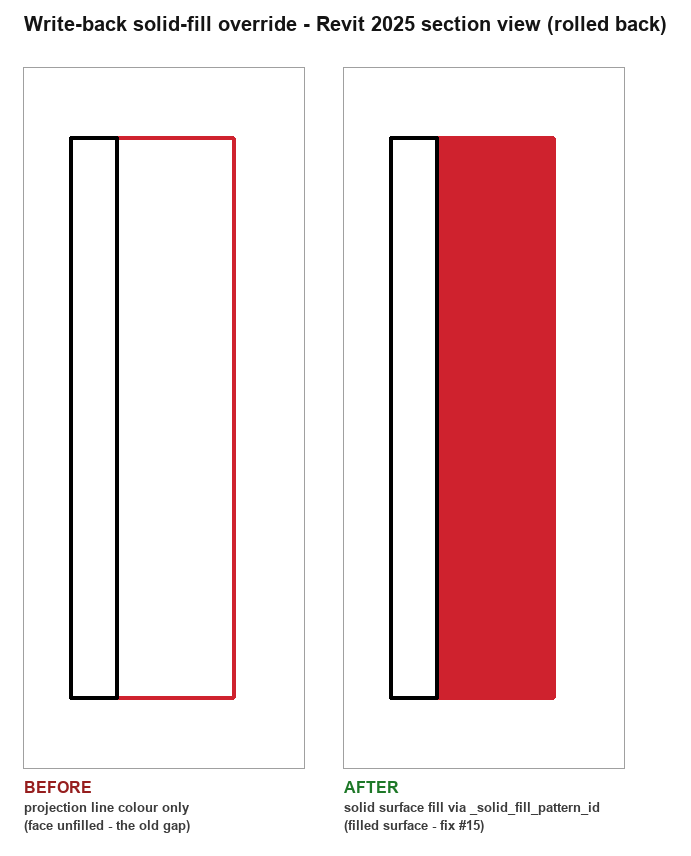

# Live validation on Revit 2025 — 2026-06-29

First validation of the LIVE `revit_*` surfaces on real hardware (Windows + Revit
2025 + pyRevit Routes/`revit_mcp`). Until now these were stubbed because the dev
environment was Linux with no Revit. Driven via the pyRevit Routes API on
`localhost:48884` (Sterling `revit_mcp` extension).

## Environment
- Revit **2025** (`Autodesk Revit 2025`), API year 2025, .NET 8.
- Model: `sterlingrevittools/tests/fixtures/FIXTEST_AVX_R25.rvt` (a Sterling
  view/filter fixture — 7 levels, 62 views, **no placed building geometry or
  low-voltage devices**). Good enough for the export/affine/project surfaces;
  device extraction + write-back need a populated model (production model pending).
- MCP execution context is IronPython 2.7 (`/revit_mcp/execute_code/`); the
  production extension targets pyRevit CPython 3.8. API surface is the same.

## Gotcha found & fixed: MCP discovery deadlock (no open document)
`revit_mcp` discovery probes `GET /revit_mcp/status/`, which returns **503**
unless an active document is open (`status.py`: `if doc:` → else 503). With Revit
launched to the home screen (no doc), every MCP tool — including `open_document`
— failed discovery (`instance_registry.parse_status` drops any instance whose
`status != "active"`). Chicken-and-egg.

**Break the deadlock** by POSTing straight to the Routes server (the port is open
even with no doc), to the `/open_document/` route, which uses
`revit.HOST_APP.uiapp` and is explicitly written for the `uidoc is None` case:

```
POST http://127.0.0.1:48884/revit_mcp/open_document/
{"file_path": "C:\\...\\model.rvt"}
```

Once a document is open, `/status/` flips to `"active"` and normal MCP tools work.

## Results

### `extract_project(doc)` — PASS
```
{'id': '651f74a4-...-00008bf0',   # doc.ProjectInformation.UniqueId
 'name': 'Project Name',          # ProjectInformation.Name (fallback doc.Title)
 'units': 'feet',                 # internal units; we emit raw internal-feet coords
 'revit_file': 'C:\\...\\FIXTEST_AVX_R25.rvt'}
```
Decision confirmed: do **not** touch `DisplayUnitType` (legacy) — Revit internal
units are always feet, and we emit internal-feet coordinates, so `units="feet"`
is correct by construction.

### Floorplan export + `pixel_to_model` affine — PASS (the trickiest surface)
Method: on a real `ViewPlan`, inside a `Transaction` that is **rolled back**, set
an asymmetric crop, `Regenerate()`, `doc.ExportImage(opts)` (PNG persists on disk
during the open txn), then roll back so the model is untouched (Sterling
`vision_render` pattern). PNG dims read from the IHDR header (`struct.unpack('>II',
data[16:24])`) — no PIL dependency.

- Crop: local x ∈ [-50, 50], y ∈ [-30, 30] ft (asymmetric, to catch an axis swap).
- `ImageExportOptions`: `ZoomFitType.FitToPage`, `PixelSize=1200`,
  `FitDirection=Horizontal` (longer edge), `HLRandWFViewsFileType=PNG`.
- **Exported PNG: 1200 × 720.**  crop_aspect 1.6667 == img_aspect 1.6667 →
  **no letterbox.**

Affine `[a,b,c,d,e,f]` with `X=a*px+b*py+c, Y=d*px+e*py+f`
(px,py top-left origin, +py down):
```
[0.08333, 0.0, -50.0,  0.0, -0.08333, 30.0]
  a = (cmax.X-cmin.X)/W   b = 0   c = cmin.X
  d = 0   e = -(cmax.Y-cmin.Y)/H   f = cmax.Y
px(0,0)     -> (-50.0,  30.0)   ✓
px(W,H)     -> ( 50.0, -30.0)   ✓
px(W/2,H/2) -> (  0.0,   0.0)   ✓
```

**Key finding:** Revit 2025 `ExportImage` with `FitDirection` following the longer
crop edge fills the image with the crop extent at matching aspect ratio (no
letterbox), so the simple axis-aligned affine derivation is exact. For a rotated
plan (project-north / rotated scope box) use the full `CropBox.Transform` basis
form (already specified in `revit_export.py`); this fixture's basis is identity.

### `extract_devices(doc, level_lookup)` — collector runs clean, 0 devices here
Walked `OST_SecurityDevices, OST_CommunicationDevices, OST_ElectricalFixtures,
OST_AudioVisualDevices, OST_DataDevices, OST_NurseCallDevices,
OST_FireAlarmDevices, OST_TelephoneDevices` — all categories resolve on R2025, **0
instances** in this fixture (it has none placed). Path executes without error.
**Needs a populated production model to validate UniqueId / family / type / level
/ position / orientation extraction.**

### `revit_writeback` (apply/clear idempotency) — NOT yet validated live
Needs real overridable elements (this fixture has no geometry). Pending the
production model.

## ElementId on Revit 2025 (confirmed)
`ElementId.Value` (Int64) is present and is the right accessor on 2025;
`int(eid.Value)` works. Vendored `lib/ca_elevation_revit/_compat.py`
(`eid_value` / `make_eid`) mirrors Sterling `revit_compat` for 2025/2026 safety.

## Part 2 — production-model validation (2026-06-29, later same day)

The three items below were previously blocked on "a model with real placed
devices" (the `FIXTEST_AVX` fixture has zero). They are now **validated against a
real workshared production model** opened on the same Revit 2025 machine.

**Client-data firewall.** That model is a client production model and this repo is
public, so **nothing identifying is recorded here** — no project name, path,
level/family/type names, coordinates, UniqueIds, or exported imagery. Only shapes,
counts, and pass/fail. All identifiers below are SHA-1-truncated or counted.

**Non-destructive method (model left pristine).** Extraction is read-only.
Write-back and any render run inside a `TransactionGroup` that is **rolled back** —
which, confirmed here, restores `Document.IsModified == false` even after inner
`Transaction.Commit()`s. The model was **never saved and never synced**
(per instruction). Post-run scan: 0 leaked overrides, 0 leaked Comments markers,
`IsModified == false`. The heavy-linked-model `doc.Regenerate()` was avoided
(it can wedge Revit); the export/affine mechanic is already proven exact above, so
the bundle→engine chain (item 3) ran on real *device* data via the real `lib` +
engine on the PC rather than re-exporting the heavy model.

**Environment delta.** Revit **2025.4**; pyRevit **6.1.0.26047** (bundled CPython
engine **`CPY3123` = 3.12.3**). MCP `execute_code` is IronPython 2.7 (as before);
the inline probes therefore mirror the lib's `_compat.element_name` **descriptor**
workaround — a naive `getattr(sym, "Name")` returns `""` under IronPython (the
exact quirk that helper exists to defeat); the descriptor path returns the real
name. Production runtime is CPython 3.12.3 where plain `.Name` works.

### Item 1 — `extract_devices` against real devices — **PASS**
Walked the 7 device categories over the host model:
- **2,658 devices** (Security 32, ElectricalFixtures 24, Communication 164,
  Data 2,438; AudioVisual/NurseCall/FireAlarm categories resolve on R25, 0
  instances here). 12 levels in the model.
- **UniqueId identity invariant: 2,658 / 2,658 round-trip** via
  `doc.GetElement(uniqueId)` → same `ElementId`, **0 failures**. This is the
  migration-plan acceptance criterion (the bug that "passes every CI test yet
  resolves nothing live"), proven on real data.
- **Level-parameter fallback genuinely exercised:** only **133** devices expose
  their level via `Element.LevelId`; **2,128** resolve *only* through the
  `SCHEDULE_LEVEL_PARAM` fallback (lost without it); **397** have no resolvable
  level (correctly skipped by design — `skipped_level`).
- **Position:** 2,656 `Location.Point`, **2** bbox-centre fallback (the documented
  curve/line caveat), 0 unlocatable. **Orientation:** 2,658 / 2,658 via
  `FacingOrientation`. Family + type names non-empty via descriptor-safe
  `element_name` (16/16 sampled, lengths 1–29).

### Item 2 — `revit_writeback` idempotency + solid fill — **PASS (API-level)**
Apply → verify → clear-by-marker → drop-a-device → verify → rollback, all in one
rolled-back `TransactionGroup` on real overridable elements (a real `View3D`):
- Apply 6/6: projection-line colour set; **surface foreground pattern id == the
  resolved solid `FillPatternElement` and `IsSurfaceForegroundPatternVisible ==
  True`** (the #15 fill fix, proven at the API level — the prior gap was a *null*
  pattern id → empty fill); Comments sentinel stamped 6/6.
- `_solid_fill_pattern_id` resolved a drafting solid fill (not None).
- Clear-by-marker found & reset all 6 prior overrides **without** the new id set.
- **Drop-a-device:** the device removed from the new report returned to default
  overrides **and** lost its marker; the 5 kept devices re-coloured + re-marked.
- After group rollback: 6/6 default, 6/6 unmarked, `IsModified == false`.
- **Visual eyeball — captured** on a client-data-free fixture
  (`sterling_test_model_R25`, a generic Sterling test wall; the production model
  itself is never rendered to a committable image). Same element rendered twice in
  a rolled-back section view — line-colour-only (the old gap: red edges, unfilled
  face) vs the solid-fill override (the face renders as a solid red fill):

  

  R2025 method notes: `IsolateElementsTemporary` **and** `doc.Regenerate()` each
  require an open transaction; `ExportImage` `FitToPage` on a 3D view frames the
  whole-model extent (not an isolated element far from the origin), so a **section
  view** (deterministic crop) is the reliable way to frame one element. All render
  work ran inside a rolled-back `TransactionGroup` (`IsModified == false` after).

### Item 3 — full bundle → engine → writeback on real data — **PASS**
60 real device records (one level, read-only) → the **real `lib`**
(`device_dict` → `build_manifest` → `bundle_io.write_field_bundle`) → the **real
`ca-elevation run`** CLI (own venv, CPython 3.11) → `verdict_report.json`
(rc 0) → the **real `writeback.overrides_for_report`** mapping:
- 60 device results; synthetic capture exercised all four verdicts —
  **absent 10, flag 13, type_mismatch 11, pass 26**.
- 60 overrides built; all four palette colours used; **sentinel colour used 0×**
  (no unmapped verdict); **every override `device_id` is a real Revit UniqueId**.
- Floorplan record used the affine proven in Part 1; engine run was `--format
  json` (no image needed). Closes the identity loop end-to-end: extract stamps
  UniqueId → manifest → engine echoes → writeback resolves by it.

### Open item 1 (pyRevit pin + CPython floor) — **RESOLVED**
Pin **pyRevit ≥ 6.1.0** (machine on 6.1.0.26047, latest). #3092 (6.0.0
`#! python3`→IronPython misroute) is **closed via PR #3098** and fixed from
**6.1.0** ("PyRevitRunner honors CPython hashbang"). Bundled CPython on the pin is
**3.12.3**; the `lib/` **3.8** lint floor is kept as the conservative target. The
`script.py` runtime guard stays the in-Revit enforcer. See
`docs/pyrevit-migration-plan.md` Open item 1.

### Still open (acceptable / deferred)
- [x] Committable solid-fill **screenshot** — captured (see item 2 above,
      `images/writeback-solid-fill-eyeball.png`).
- [ ] Documented minor caveats remain acceptable: curve/line devices use bbox-z
      (2 seen here); `up_axis` hardcoded `'up'`.
